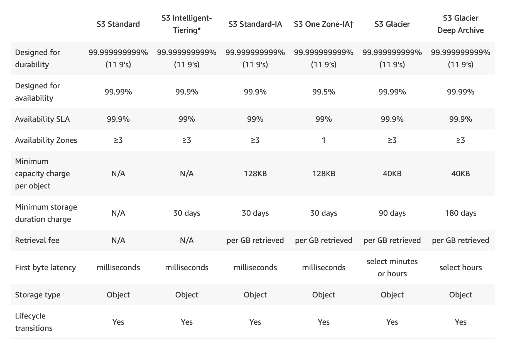
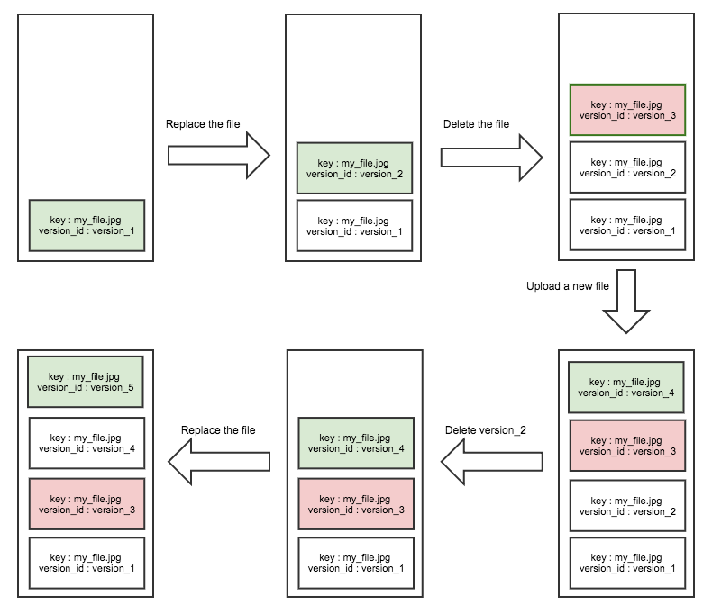
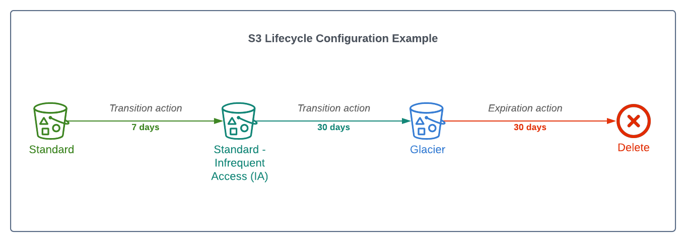
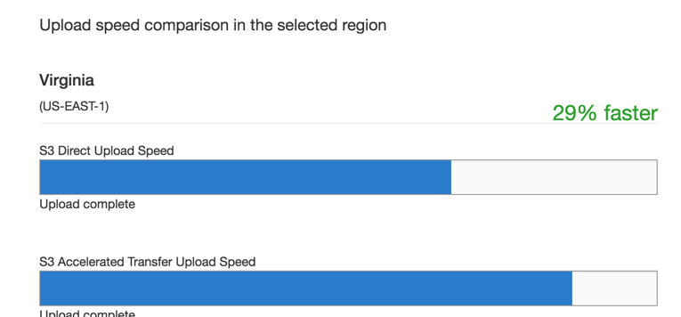
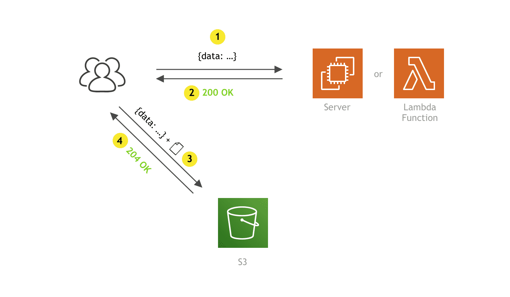

#### About
It's a service to store any objects. As Serverless storage in the Cloud, that's no need to worry about filesystems or disk space.

For all topics, there is a link in the end with more info about it.

#### Uses
It could be used as a Data Lake, cloud-native applications, mobile apps.

A more common example is to host a static website like this blog one. Another one is to store files to your client's downloads later and go on.

#### Pricing
It's unlimited storage, so no need to stress about space at all.

The charge is on-demand, so the price scaling when storing big objects  (in houses of many Terabytes) and a lot of operations on it, like "Put" and "Get objects" other charge components include Data Transfer, Management (analytics), Replications, and Lambda Store.

#### How it works
A brief comparison to storage mechanics:
- File systems: handle data as a "files and fire" hierarchy (delete folder delete files on it).
- Block storage: handle data as a block within sectors and tracks.
- Object storage (s3): handle data as individual objects within key and version (if enabled).

In S3, we have only these elements:

S3Object:
- Key: Object name.
- Value: Data itself, made up of a sequence of bytes (normally file data)
- Version ID: Object version (only if enabled).
- Metadata: Object additional data, like size, content-type, or user-specific information, like user_id, system, etc.
- The object size can be from 0 to 5 Terabytes.

S3Bucket:
- Buckets stores objects. Names must be unique (like a domain name).

#### Storage Classes
Trade Retrieval Time, Accessibility and Durability for Cheaper Storage.

The classes are:
- S3 Standard: general-purpose storage of frequently accessed data
- S3 Intelligent-Tiering: data with unknown or changing access patterns
- S3 Standard-Infrequent Access (S3 Standard-IA) and S3 One Zone-Infrequent Access (S3 One Zone-IA): long-lived, but less frequently accessed data
- Amazon S3 Glacier (S3 Glacier) and Amazon S3 Glacier Deep Archive (S3 Glacier Deep Archive) for long-term archive and digital preservation

Technical comparison table:

#### Security

#### Access
All buckets are **PRIVATE** by default.

Access to bucket objects can be controlled by:
- Access Control List (ACL): Deprecated, should not be used.
- Bucket Policies: Define complex and fine rules.

#### Encryption
Encryption in Transit traffic between your local host and S3 is achieved by SSL/TLS.

SSE - Encryption at rest:
- S3 managed keys - Amazon manages all the keys
- SEE-AES S3 handles the key. uses AES-256 algorithm
- SEE-KMS Envelope encryption, AWS KMS and you manage the keys
- SSE-C Customer provided key (you manage the keys)

Client-Side Encryption:
- You encrypt your files before uploading them to S3.

#### Data consistency

After a successful write of a new object, or an overwrite or delete of an existing object, any subsequent read request immediately receives the latest version of the object.

S3 also provides strong consistency for list operations, so after a write, you can immediately perform a listing of the objects in a bucket with any changes reflected.

For all existing and new objects, and in all regions, all S3 GET, PUT, and LIST operations, as well as operations that change object tags, ACLs, or metadata, are now strongly consistent. What you write is what you will read, and the results of a LIST will be an accurate reflection of what’s in the bucket.

#### Cross-region replications
Needs to be enabled, after that any object that is uploaded will be automatically replicated to another region(s).

Provider higher durability and potential disaster recovery for objects. Need versioning in both buckets. Can have CRR replicate to another AWS account.

#### Versioning
You can use S3 Versioning to keep multiple versions of an object in one bucket and enable you to restore objects that are accidentally deleted or overwritten.

For example, if you delete an object, instead of removing it permanently, Amazon S3 inserts a delete marker, which becomes the current object version. You can then restore the previous version.

Once enabled it **cannot be disabled**, only suspended on the bucket!

Fully integrates with S3 Lifecycle rules for control automation. Also, MFA Delete feature provides extra protection against deletions of data.

#### Lifecycle Management
A set of rules that define actions that Amazon S3 applies to a group of objects.

There are two types of actions:
- Expiration actions: Define when objects expire. Amazon S3 deletes expired objects on your behalf.
- Transitions actions: Define when objects transition to another storage class.

#### Transfer Acceleration
Fast and secure transfer of files over long distances between your end-user and an S3 Bucket.
Utilizes Cloudfront's distributed Edge Locations.

Uses a distinct URL for an Edge Location. When data arrives there, it's automatically routed to S3 over a specially optimized network path (AWS's backbone network).

Tool to make Transfer Acceleration speed comparison: https://s3-accelerate-speedtest.s3-accelerate.amazonaws.com/en/accelerate-speed-comparsion.html

#### Presigned URL's
Generate a URL that provides you temporary access to an object to either upload or download object data.

Pre-signed Urls are commonly used to provide access to private objects. You can use AWS CLI or AWS SDK to generate Presigned URLs.

#### MFA delete
Add another layer of security by configuring a bucket to enable MFA (multi-factor authentication) delete.

When you do this, the bucket owner must include two forms of authentication in any request to delete a version or change the versioning state of the bucket.
MFA delete requires additional authentication for either of the following operations:
- Changing the versioning state of your bucket
- Permanently deleting an object version

MFA delete requires two forms of authentication together:
- Your security credentials
- The concatenation of a valid serial number, a space, and the six-digit code displayed on an approved authentication device

Versioning must be enabled to use MFA delete feature.

#### Reference
- Pricing: https://aws.amazon.com/s3/pricing/
- Documentation about IT: https://aws.amazon.com/about-aws/whats-new/2018/11/s3-intelligent-tiering/
- Strong consistency news: https://aws.amazon.com/blogs/aws/amazon-s3-update-strong-read-after-write-consistency/
- Strong consistency documentation: https://aws.amazon.com/s3/consistency/
- Versioning doc: https://docs.aws.amazon.com/pt_br/AmazonS3/latest/userguide/versioning-workflows.html
- Transfer Acceleration: https://docs.aws.amazon.com/AmazonS3/latest/userguide/transfer-acceleration.html
- Presign URL: https://docs.aws.amazon.com/AmazonS3/latest/userguide/ShareObjectPreSignedURL.html
- AWS Tips for cost reduction: https://catalog.us-east-1.prod.workshops.aws/workshops/f238037c-8f0b-446e-9c15-ebcc4908901a/en-US/002-services/002-storage/003-s3