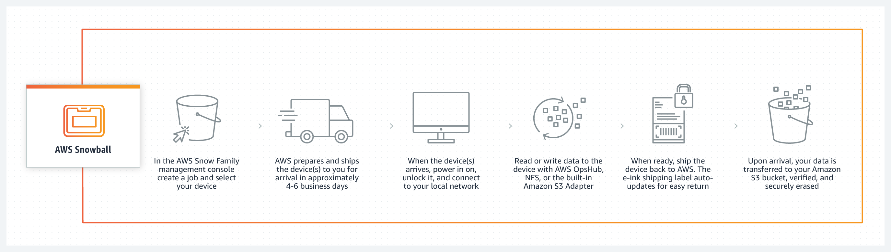
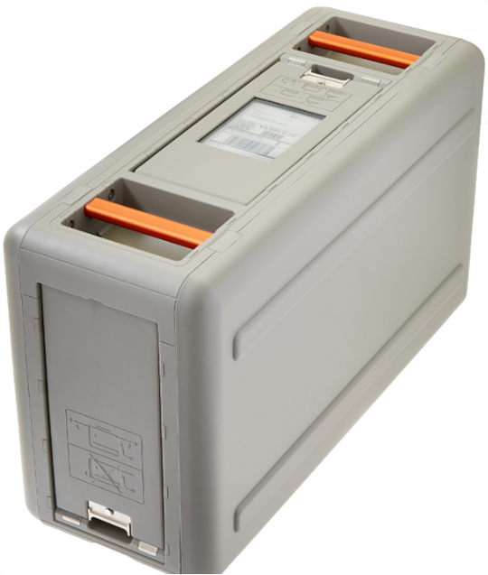
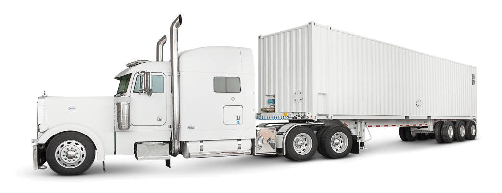

### About
A service to physically transfer data to or from AWS data centers in Petabyte-scale.

### Advantages
- Low Cost: It charges thousands of dollars to transfer 100TB over high-speed internet. Snowball can reduce that cost by 1/5th.
- Speed: it cant take 100TB over 100days to transfer over high-speed internet. Snowball can reduce that transfer time by less than a week.

Snowball Edge (100TB and 100TB Clustered):

- LCD Display
- Can undertake local processing and edge-computing workloads
- Can be used in a cluster in groups of 5 to 10 devices.

Snowmobile (100 PB):

- GPS Tracking
- Alarm monitoring
- 24/7 video surveillance
- An escort security vehicle while in transit.

-------

### Key features

#### Fast  data transfer

Feature high-speed network connections, supporting 10 Gbps to 100 Gbps. All encryption is performed on the device itself, helping enable a higher data throughput rate and shorter data transfer times.

#### AWS OpsHub
A graphical user interface to set up and manage AWS Snowball devices enabling you to rapidly deploy edge computing workloads and simplify data migration to the cloud.

#### GPU
Using the GPU option, you can run applications such as advanced machine learning and full-motion video analysis in environments with little or no connectivity.

#### Clustering
You can cluster multiple Snowball Edge devices when running edge computing jobs to create a local storage tier with increased durability for your on-premises applications.

#### S3 integration
Applications can work with Snowball Edge object storage through an S3-compatible endpoint accessed through the S3 SDK or CLI.

#### Block storage
You attach block storage volumes to Amazon EC2 instances using a subset of the Amazon EBS API that enables you to configure and manage volumes for EC2 instances on Snowball Edge devices. This makes it easier to develop applications in EC2, and then run them in disconnected and remote locations.

#### Encryption
All data transferred is automatically encrypted with 256-bit encryption keys. The encryption keys are never stored on the device to help ensure your data stays secure during transit.

#### Rugged and portable
Devices have a ruggedized case designed for durability and portability. A device weighs less than 50 pounds and can be moved by a single person.

#### Tamper evident
Snowball Edge devices feature a Trusted Platform Module (TPM) that provides a hardware root of trust. It helps to ensure the integrity of the device and with encryption features, preserving the confidentiality of your data.

#### Tape data migration
You can use a Snowball Edge Storage Optimized device with Tape Gateway to quickly and securely migrate petabyte-scale physical tape data to S3 Glacier Flexible Retrieval or S3 Glacier Deep Archive.

#### End-to-end tracking
Ensure the device is automatically sent to the correct AWS facility and also aids in tracking. After the data transfer job, it can be tracked via Amazon SNS, text messages, and via the AWS Console.

#### Secure erasure
Once the data transfer job has been processed and verified, AWS performs a software erasure of the Snowball Edge device that follows the National Institute of Standards and Technology (NIST) guidelines for media sanitization.

### References
- Main page: https://aws.amazon.com/snowball/
- FAQ's: https://aws.amazon.com/snowball/faqs/
- Features: https://aws.amazon.com/snowball/features/
